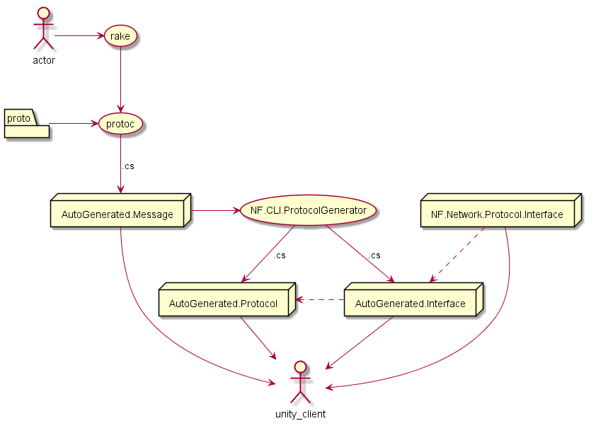

# nf.protocol-flow


[flow.puml](flow.puml)

## introduce
this is sample protocol flow. When I making a game(in unity), I don't like to hard-coding for protocol class from message. I'm writing custom class generator, and protocol exporter for that work.

If you want to use [Akka.net](http://getakka.net/), check [Akka.Interfaced](https://github.com/SaladLab/Akka.Interfaced).

## basic Knowledge.
* [Rakefile](https://github.com/ruby/rake)
* [dotnet cli](https://www.microsoft.com/net/core)
* [Protobuf](https://developers.google.com/protocol-buffers/)


# flow
1. *.proto =`protoc`=> *.cs => AutoGenerated.Message.dll
2. NF.Network.Protocol.Interface
  - IMessageSender
  - INetworkSender
3. NF.Network.Transfer.Protobuf
  -


## example
```
$ rake --version
rake, version 11.1.2
$ dotnet --version # because on macOs doesn't support latest version of dotnet cli not yet.
1.0.0-preview2-1-003177
$ rake
 ...
$ tree __BUILD
__BUILD
├── AutoGenerated.Interface.dll
├── AutoGenerated.Message.dll
├── AutoGenerated.Transfer.dll
├── NF.Network.Protocol.Interface.dll
├── NF.Network.Transfer.Protobuf.dll
└── protobuf3.dll
```

## TODO
* [ ] [Investigate support for Unity #644](https://github.com/google/protobuf/issues/644)


## etc
* https://atom.io/packages/plantuml-viewer
* https://chrome.google.com/webstore/detail/plantuml-viewer/legbfeljfbjgfifnkmpoajgpgejojooj
